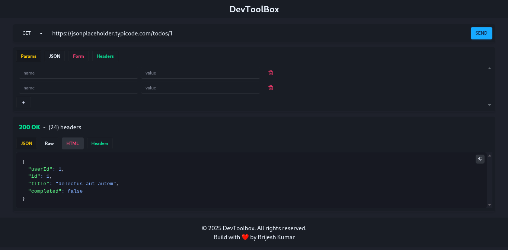

# 🌐 API Toolset (Frontend)

A lightweight, modern API client built with **HTML**, **Tailwind CSS**, and **JavaScript**.
Perform all HTTP methods (GET, POST, PUT, DELETE, etc.) with full control over headers, body, and parameters.
Supports **JSON preview**, raw response view, and headers display — all in a **responsive, modern UI**.

---

## 🚀 Features

* Send **GET, POST, PUT, PATCH, DELETE, HEAD, OPTIONS** requests.
* Add custom **headers**, **query params**, and **request body**.
* View responses in:

  * **Formatted JSON**
  * **Raw response**
  * **Headers view**
* Color-coded method selection.
* Responsive **Tailwind CSS** design (light & dark mode).
* Integrated with backend **proxy** to bypass CORS restrictions.
* Works like a lightweight **Postman** in the browser.

---

## 📸 Screenshots



---

## 📦 Installation

1. Clone the repository:

   ```bash
   git clone https://github.com/itsbrijeshio/api-toolset.git
   cd api-toolset-frontend
   ```

## ⚙️ Usage

1. Enter the **Request URL**.
2. Select the **HTTP method**.
3. (Optional) Add **headers**, **params**, or **body**.
4. Click **Send Request**.
5. View response in **JSON**, **Raw**, or **Headers** tabs.

## 📄 License

This project is licensed under the **MIT License** — feel free to use and modify it.
